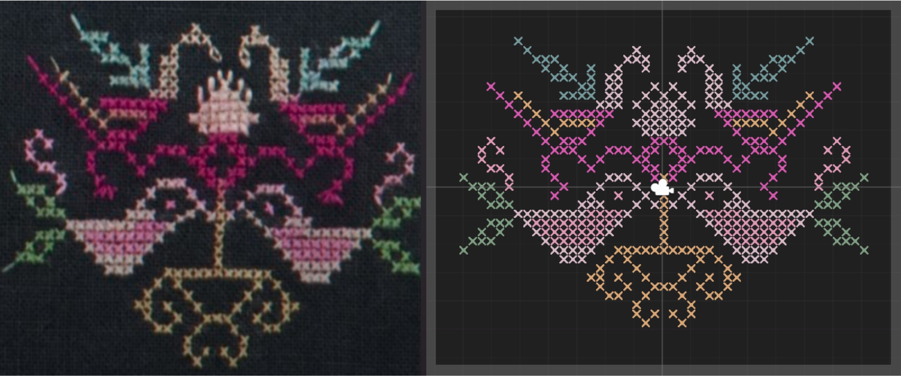
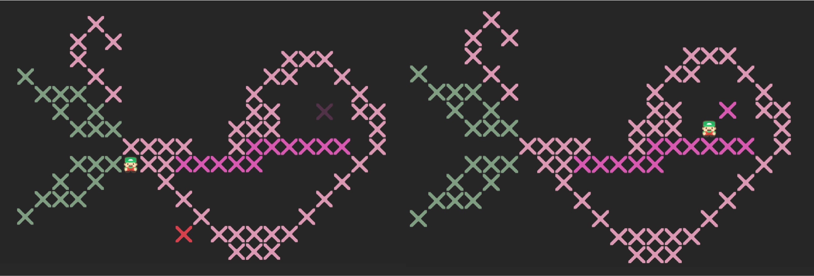

# Sokoban Game Demo

An attempt to combine [Miao Embroidery](https://artsandculture.google.com/story/miao-intangible-cultural-heritage-%E2%80%94%E2%80%94-embroidery-nationalities-museum-central-university-for-nationalities-%E4%B8%AD%E5%A4%AE%E6%B0%91%E6%97%8F%E5%A4%A7%E5%AD%A6%E6%B0%91%E6%97%8F%E5%8D%9A%E7%89%A9%E9%A6%86/dgUBcd0xLHcsKg?hl=en) with [Sokoban Game](https://en.wikipedia.org/wiki/Sokoban) (苗绣x推箱子).

- build in Unity 2021.3.23
- use arrow key to move the task box to the target position
- can move other boxes away to carve out a way
